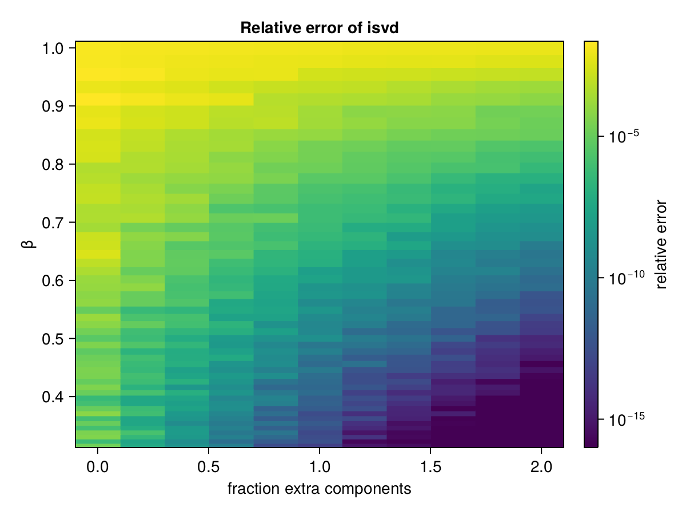

# ISVD

ISVD provides incremental (updating) singular value decomposition.
This allows you to update an existing SVD with new columns, and even implement
online SVD with streaming data.

## All-at-once usage

For reasons that will be described below, if you want a truncated SVD and your matrix is small enough to fit in memory,
you're better off using [TSVD](https://github.com/JuliaLinearAlgebra/TSVD.jl). However, ISVD can do it too:

```julia
julia> using ISVD, LinearAlgebra

julia> X = randn(5, 12);

julia> U, s = isvd(X, 4);    # get a rank-4 truncated SVD

julia> Vt = Diagonal(s) \ (U' * X);
```

Note that `Vt` is *not* returned by `isvd`; for reasons described [below](#on-the-fly-v) we compute it afterwards.

`isvd` uses incremental updating, which is lossy to an extent that depends on the distribution of singular values.
For comparison:

```julia
julia> using TSVD

julia> U2, s2, V2 = tsvd(X, 4);

julia> norm(X - U*Diagonal(s)*Vt)
1.9647749407433712

julia> norm(X - U2*Diagonal(s2)*V2')
1.9177860422120783
```
In this particular case, the TSVD is a few percent better than the ISVD.
The error of incremental SVD comes from the fact that it works on chunks, and there is a truncation step after each chunk that discards information; see Brand 2006 (full citation at the bottom of the page), Eq 5 for more insight.

However, the *real* use-case for ISVD is in computing incremental updates or handling cases where `X` is too large to fit in memory all at once, and for such applications it handily beats alternatives like random projection + power iteration (e.g., `rsvd` from [RandomizedLinAlg.jl](https://github.com/JuliaLinearAlgebra/RandomizedLinAlg.jl)).

## Incremental updates

Here's a demo in which we process `X` in chunks of 4 columns:

```julia
julia> using ISVD, LinearAlgebra

julia> X = randn(5, 12);

julia> U, s = ISVD.update!(nothing, nothing, X[:,1:4]);   # use `nothing` to initialize

julia> ISVD.update!(U, s, X[:, 5:8]);

julia> ISVD.update!(U, s, X[:, 9:12]);

julia> s
4-element Vector{Float64}:
 4.351123559463465
 4.18050301615471
 3.662876466035874
 2.923979120208828

julia> F = svd(X);

julia> F.S
5-element Vector{Float64}:
 4.351167907836934
 4.182452959982528
 3.669488216333535
 2.9398639871271564
 1.7956053622541457
```

`isvd` is just a thin wrapper over this basic iterative update.

## Reducing error

The most straightforward way to reduce error is to retain more components than you actually need.
We can estimate this error by generating covariance matrices where eigenvalue $\lambda_{k+1} = \beta \lambda_k$ for a constant $0 \le \beta \le 1$.
Using this covariance matrix, we generate 1000 samples in a 100-dimensional space, and compare the accuracy of `isvd` vs `svd` for 5 retained components.
Without any extra components, the error for $\beta=1$ is approximately 1.8% and drops below 0.1% for $\beta \approx 0.78$.
Conversely, if we compute `isvd` with twice as many components as we expect to keep, the error for $\beta=1$ is 1.2% and drops below 0.1% for $\beta \approx 0.93$.
(For comparison, `rsvd` from [RandomizedLinAlg.jl](https://github.com/JuliaLinearAlgebra/RandomizedLinAlg.jl) with no extra components has an error of 11% at $\beta=1$ and stayed above 5% for all tested $\beta$; with twice as many components the error was 4.4% at $\beta=1$ and did not drop below 0.1% until $\beta = 0.35$.)
The relative error as a function of both $\beta$ and the number of "extra" components retained can be shown as a heatmap:



(A fraction 2.0 of extra components means that if we're keeping 5 components, we compute with 2.0*5=10 *extra* components, meaning `isvd` is called with 15 components. Only the top 5 are retained for the error calculation.)
In the figure above, `isvd` is shown on the left, and `rsvd` on the right.

Full details can be found in the [analysis script](test/accuracy/accuracy.jl).

## Advanced usage

You can reduce the amount of memory allocated with each update by supplying a cache for intermediate results.
See `?ISVD.Cache`.

ISVD performs NaN-imputation. While in normal usage it doesn't modify values of `X` in-place, see `?ISVD.impute_nans`.

## On-the-fly V

Why doesn't `isvd` return `V`? This is because `X` is processed in chunks, and both `U` and `s` get updated
with each chunk; if we computed `V` "on-the-fly", the early rows of `V` would be computed from an early
approximation of `U` and `s`, and thus inconsistent with later rows. *The error that comes from not using a fully "trained" `U` and `s` can be very large*.

In online applications, a good strategy might be to "train" `U` and `s` with enough samples, and then start
computing `V` once trained (no longer updating `U` and `s`).

But for online applications where you can't afford to throw away anything---even at the cost of *large* errors in the early columns of `Vt`---here's how you can do it:

```julia
function isvd_with_Vt(X::AbstractMatrix{<:Real}, nc)
    Base.require_one_based_indexing(X)
    T = float(eltype(X))
    U = s = nothing
    Vt = zeros(T, nc, size(X, 2))
    cache = ISVD.Cache{T}(size(X,1), nc, nc)
    for j = 1:nc:size(X,2)
        Xchunk = @view(X[:,j:min(j+nc-1,end)])
        U, s = ISVD.update!(U, s, Xchunk, size(Xchunk, 2) == nc ? cache : nothing)
        Vt[:,j:min(j+nc-1,end)] = Diagonal(s) \ (U' * Xchunk)
    end
    return U, s, Vt
end
```

This is just a minor extension of the source-code for `isvd`.


## References

The main reference is

> Brand, M. "Fast low-rank modifications of the thin singular value
> decomposition."  Linear algebra and its applications 415.1 (2006):
> 20-30.

NaN-imputation is described in

> Brand, M. "Incremental singular value decomposition of uncertain
> data with missing values."  Computer Vision—ECCV 2002. Springer
> Berlin Heidelberg, 2002. 707-720.

